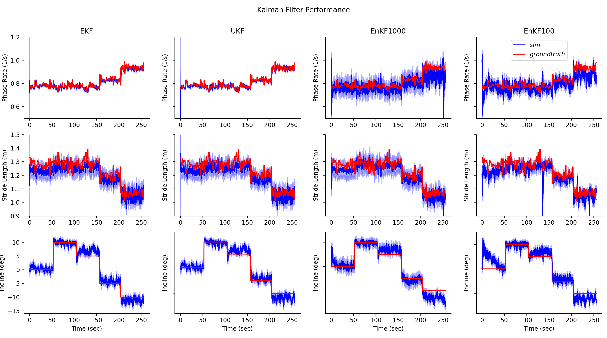

# Modular Lower-Limb Exoskeleton Kalman Filter Evaluation

This project is an initial exploration into which type of Kalman Filter would be optimal to estimate the gait state usings the sensors on the M-BLUE exoskeleton. We consider three competing Kalman Filters: the Extended Kalman Filter, the Unscented Kalman Filter, and the Ensemble Kalman Filter. We also consider different combinations of measured kinematics: foot, shank, thigh, and pelvis angles. We performed simulations to identify which Kalman Filter and sensor combination would be a good choice to drive the state estimation of an exoskeleton controller for M-BLUE. 

A sample simulated walking trial is shown below:

This work is performed under the [Neurobionics Laboratory](https://neurobionics.robotics.umich.edu/) and the [Locomotor Control Systems Laboratory](https://web.eecs.umich.edu/locolab/) under Drs. Elliott Rouse, Robert Gregg, and Gray Thomas.

Many thanks to [Dr. Alex Gorodetsky](https://www.alexgorodetsky.com/index.html) and his AE 567 class for imparting the tools and information needed to execute this project.